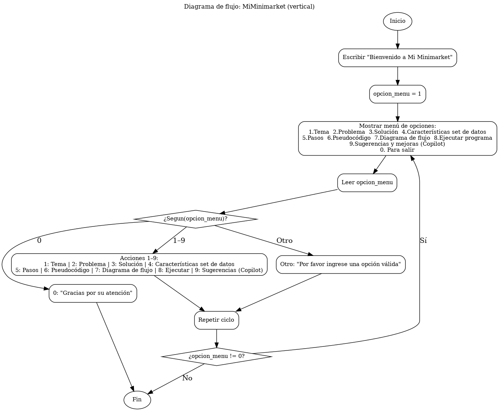

___

## 1. Tema
**🛍️ Mi Minimarket - Proyecto de Estudio de IA y Análisis de Datos con Excel**

Este proyecto Python es un entorno de estudio integral que simula la gestión de un minimarket. Se centra en la aplicación práctica de conceptos de Inteligencia Artificial y Machine Learning, utilizando librerías como `pandas` y `numpy` para la manipulación y análisis de datos almacenados en archivos Excel, y culminando en la visualización de insights mediante un dashboard en Power BI.

___

## 2. 🎯 Problema - Objetivo del Proyecto

El objetivo principal de este proyecto es:
*   **Dominar el ciclo de vida del análisis de datos:** Desde la limpieza y transformación de datos hasta el modelado de Machine Learning y la visualización de resultados.
*   **Aplicar Python y librerías clave:** Utilizar `pandas` para gestión de datos, `numpy` para operaciones numéricas eficientes, y `scikit-learn` para implementar modelos de Machine Learning.
*   **Generar insights accionables:** Obtener conclusiones significativas de los datos del marketplace y presentarlas de manera efectiva en un dashboard de Power BI.
*   **Simular un entorno de marketplace:** Gestionar información de clientes, productos y transacciones de ventas con archivos Excel.

___

## 3. Solución

Se propone la elaboración de una **documentación detallada** y estructurada para para este proyecto de tal manera que describa los procesos, componentes y funcionalidades que se plasmarán en un programa ejecutable. Esta documentación servirá como base para el diseño, implementación y mantenimiento de futuras soluciones tecnológicas dentro de esta solución.

Adicionalmente, se plantea la creación de un **programa** que permita visualizar la documentación desde un menú de **forma interactiva**, facilitando la consulta de la documentación completa el proyecto. Este sistema interactivo permitirá acceder a la información técnica de manera dinámica, organizada y actualizable; promoviendo la colaboración y mejora continua de los procesos tecnológicos del proyecto.

___

## 4. Dataset de referencia: fuente, definición, estructura, tipos y escala de medición
# 4.1 Fuente
El proyecto se basa en los siguientes archivos de Excel, que actúan como nuestra "base de datos" para las distintas fases del análisis.

# 4.2 Definición
**Simular un entorno de marketplace:** Gestionar información de clientes, productos y transacciones de ventas con archivos Excel.

**Clientes** 
*   **`clientes.xlsx`**  — ~100 filas: Contiene la información detallada de los clientes registrados en el marketplace.
**Detalle de campos**

| Campo             | Tipo | Escala   |
|-------------------|------|----------|
| id_cliente        | int  | Nominal  |
| nombre_cliente    | str  | Nominal  |
| email             | str  | Nominal  |
| ciudad            | str  | Nominal  |
| fecha_alta        | date | Intervalo|

**Productos**
*   **`productos.xlsx`** — ~100 filas: Almacena los datos de los productos disponibles para la venta.
**Detalle de campos**

| Campo             | Tipo | Escala   | 
|-------------------|------|----------| 
| id_producto       | int  | Nominal  | 
| nombre_producto   | str  | Nominal  |
| categoria         | str  | Nominal  |
| precio_unitario   | int  | Razón    |

**Ventas**
*   **`ventas.xlsx`** — ~120 filas: Contiene el resumen de cada transacción de venta realizada en el marketplace.
**Detalle de campos**

| Campo             | Tipo | Escala    |
|-------------------|------|-----------|
| id_venta          | int  | Nominal   |
| fecha             | date | Intervalo |
| id_cliente        | int  | Nominal   |
| nombre_cliente    | str  | Nominal   |
| email             | str  | Nominal   |
| medio_pago        | str  | Nominal   |

**Detalle Ventas**
*   **`detalle_ventas.xlsx`** — ~300 filas: Registra los productos individuales que forman parte de cada venta, con sus cantidades y precios específicos.
**Detalle de campos**

| Campo             | Tipo | Escala  |
|-------------------|------|---------|
| id_venta          | int  | Nominal |
| id_producto       | int  | Nominal |
| nombre_producto   | str  | Nominal |
| cantidad          | int  | Razón   |
| precio_unitario   | int  | Razón   |
| importe           | int  | Razón   |

___

## 5. Pasos
1. Abrir o correr el programa por consola
2. Mostrar el menú de opciones
3. Leer las opciones
4. Permitir que el usuario escriba una opción del menú
5. Enviar la opción seleccionada
6. Mostrar la información que corresponde a la opción seleccionada
7. Mostrar la opción de cerrar o elegir otra opción
8. Ejecutar la opción que corresponda, resolviendo la petición o cerrando el programa

___

## 6. Pseudocódigo 
Pseudocódigo o flujo de ejecución dentro del programama en python.

```
Algoritmo MiMinimarket
	Escribir "Bienvenido a Mi Minimarket"
	Definir opcion_menu Como Entero
	opcion_menu = 1
	Mientras opcion_menu <> 0 Hacer
		Escribir "Seleccione una de las opciones"
		Escribir "Opciones"
		Escribir "1. Tema"
		Escribir "2. Problema"
		Escribir "3. Solución"
		Escribir "4. Caracteristicas set de datos"
		Escribir "5. Pasos"
		Escribir "6. Pseudocódigo"
		Escribir "7. Diagrama de flujo"
		Escribir "8. Ejecutar el programa"
		Escribir "9. Sugerencias y mejoras aplicadas con Copilot"
		Escribir "0. Para salir"
		Leer opcion_menu
		Segun opcion_menu Hacer
			1:
				Escribir "Tema"
			2:
				Escribir "Problema"
			3:
				Escribir "Solución"
			4:
				Escribir "Caracteristicas set de datos"
			5:
				Escribir "Los pasos"
			6:
				Escribir "El pseudocódigo"
			7:
				Escribir "El diagrama de flujo"
			8:
				Escribir "Ejecutar el programa"
			9:
				Escribir "Sugerencias realizadas por copilot"
			0:
				Escribir "Gracias por su atención"
			De Otro Modo:
				Escribir "Por favor ingrese una opción válida"
		Fin Segun
	Fin Mientras
FinAlgoritmo
```
___

## 7. Diagrama de flujo

El diagrama de flujo de **Mi Minimarket** se presenta a continuación:



___

## 8. Ejecutar el programa
Para ejecutar el programa se debe abrir por terminal el main.py o sí abre el archivo desde visual studio code, se puede ejecutar directamente desde el play que viene con el ide.

**📁 Estructura del Proyecto**

```text
.
├── README.md                           # Documentación para mostrar en github
├── visor_documentacion_md_buscar.py    # Script principal con la lógica de gestión y análisis
├── sources/imeges
│   ├── diagrama_minimarket.png         # Diagrama de flujo del programa en consola
├── database/
│   ├── clientes.xlsx                   # Información detallada de clientes
│   ├── detalle_ventas.xlsx             # Detalles de cada producto en una venta
│   ├── productos.xlsx                  # Catálogo de productos
│   └── ventas.xlsx                     # Resumen de cada transacción de venta
└── requirements.txt                    # Dependencias del proyecto
```

**🛠️ Tecnologías Utilizadas o a utilizar proximamente**

*   **Python 3.x**
*   **pandas**: Biblioteca esencial para la lectura, manipulación, análisis y escritura de datos tabulares en archivos Excel.
*   **openpyxl**: Backend necesario para `pandas` para interactuar con archivos de Excel en formato `.xlsx`.
*   **scikit-learn**: Implementación de algoritmos de `Machine Learning`.
*   **Matplotlib y Seaborn**: `Visualización` de datos en Python.
*   **Power BI Desktop**: Creación de informes y `dashboards interactivos`.
___

## 9. Sugerencias y mejoras aplicadas con IA

Main (.py)
* Debe permitir obtener información del proyecto

* **Sugerencias y mejoras aplicadas con IA**
    * Luego de realizar un prompt para mejorar el programa ejecutable, se realizar una separación de la documentación en un diccionario reutilizable y de cierta manera desacoplado.

    * Se realizó una mejora añadiendo dos opciones de menú adicionales que corresponden a:
        * Opción de búsqueda: para localizar palabras clave dentro de la documentación (e.g., “tema”, “solución").
        * Opción de “exportar sección”: para guardar en .txt/.md lo mostrado por pantalla.

**Desarrollado por: Edwar Jaramillo**
**Contacto: [Perfil github](https://github.com/eajaramillo)**
**Contacto: [Proyecto Aurelion](https://github.com/eajaramillo/guayerd_IBM/tree/main/Edwar%20Jaramillo%20-%20Aurelion)**
```
(Versión README para Github)

Recursos
Pandas Cheat Sheet for Data Science in Python
https://www.datacamp.com/cheat-sheet/pandas-cheat-sheet-for-data-science-in-python
```